# VsPunk 🎵

Un blog moderne dédié à la musique, développé avec Laravel.

## 📋 Prérequis

- PHP >= 8.0
- Composer
- Node.js & NPM
- MySQL ou SQLite

## 🚀 Installation

### 1. Cloner le projet

```bash
git clone https://github.com/leoyeh62/VsPunk.git
cd VsPunk
```

### 2. Installer les dépendances

```bash
# Dépendances PHP
composer install

# Dépendances JavaScript
npm install
```

### 3. Configuration de l'environnement

```bash
# Copier le fichier d'environnement
cp .env.example .env

# Générer la clé d'application
php artisan key:generate
```

### 4. Configuration de la base de données

Éditez le fichier `.env` et configurez votre base de données :

**Pour SQLite (développement local) :**
```env
DB_CONNECTION=sqlite
# Commentez les lignes suivantes
# DB_HOST=127.0.0.1
# DB_PORT=3306
# DB_DATABASE=vspunk
# DB_USERNAME=root
# DB_PASSWORD=
```

**Pour MySQL (production) :**
```env
DB_CONNECTION=mysql
DB_HOST=127.0.0.1
DB_PORT=3306
DB_DATABASE=vspunk
DB_USERNAME=votre_utilisateur
DB_PASSWORD=votre_mot_de_passe
```

### 5. Initialiser la base de données

```bash
# Créer les tables
php artisan migrate

# Ou réinitialiser complètement
php artisan migrate:fresh

# Créer le lien symbolique pour le stockage
php artisan storage:link

# Copier les images par défaut
cp -r resources/images storage/app/public

# Peupler avec des données de test (optionnel)
php artisan db:seed
```

### 6. Compiler les assets

```bash
# Mode développement (avec hot reload)
npm run dev

# Mode production
npm run build
```

### 7. Lancer l'application

```bash
php artisan serve
```

Votre application sera accessible sur **http://localhost:8000**

## 🛠️ Technologies utilisées

- **Backend** : Laravel (PHP)
- **Frontend** : Blade Templates, CSS
- **Base de données** : MySQL / SQLite
- **Build** : Vite

## 📦 Structure du projet

```
VsPunk/
├── app/              # Logique applicative (Controllers, Models, etc.)
├── config/           # Fichiers de configuration
├── database/         # Migrations et seeders
├── public/           # Point d'entrée et assets publics
├── resources/        # Vues Blade, CSS, images
├── routes/           # Définition des routes
├── storage/          # Fichiers générés et uploads
└── tests/            # Tests unitaires et fonctionnels
```

## 🔧 Commandes utiles

```bash
# Vider le cache
php artisan cache:clear

# Regénérer les autoloads
composer dump-autoload

# Lancer les tests
php artisan test

# Créer un nouveau contrôleur
php artisan make:controller NomController

# Créer une nouvelle migration
php artisan make:migration create_nom_table
```

## 🚢 Déploiement

### Configuration CI/CD (GitLab)

Le projet est configuré avec GitLab CI pour un déploiement automatique. Configurez les variables suivantes dans votre projet GitLab :

- `NAME` : Votre identifiant de connexion sur le serveur
- `SSH_PRIVATE_KEY` : Votre clé SSH privée

### Déploiement manuel

```bash
# Sur le serveur de production
composer install --optimize-autoloader --no-dev
php artisan config:cache
php artisan route:cache
php artisan view:cache
npm run build
```

## 👥 Contributeurs

Projet développé par **but25_groupe2**
- Léo Morel
- Jean-Baptiste Hie
- Martin Bacqueville
- Baptiste Dewaele
- Alexis Coquel
- Gaspard Degorre
- Hugo Legrand
- Théo Marquilly

## 📝 Licence

Ce projet est un projet éducatif développé dans le cadre d'un cursus universitaire.

## 🐛 Signaler un bug

Si vous rencontrez un problème, n'hésitez pas à ouvrir une [issue](https://github.com/leoyeh62/VsPunk/issues) sur GitHub.

## 🖼️ Images du Site 

### Page d'accueil
.jpeg)

### Liste des articles
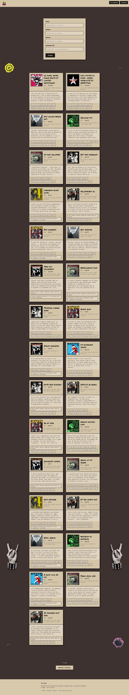

### Exemple d'article
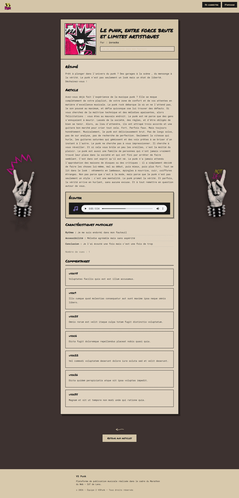

### Profil d'un utilisateur
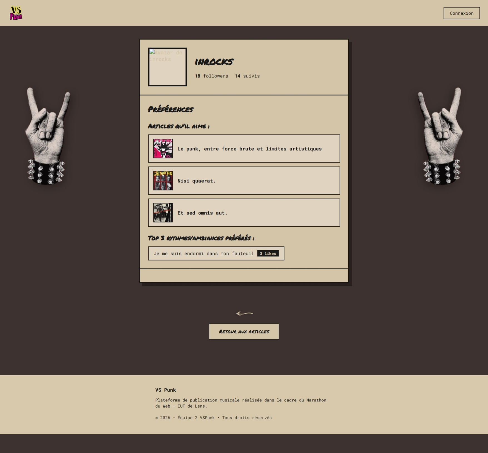

### Création d'un article 
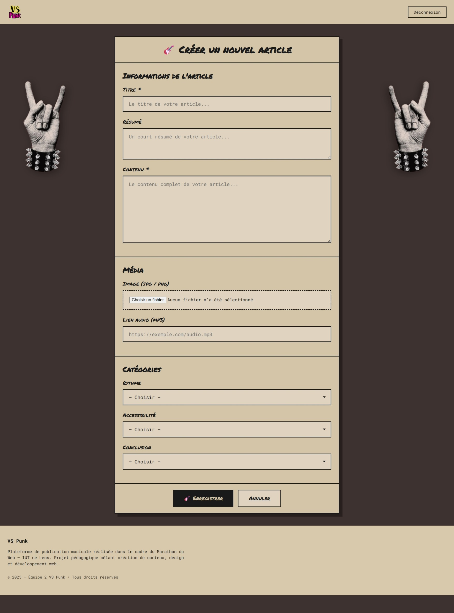

### Article personnel
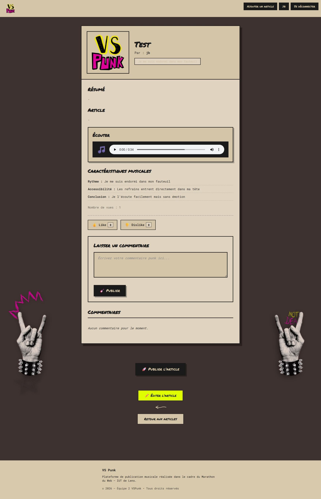

### Edition de l'article personnel
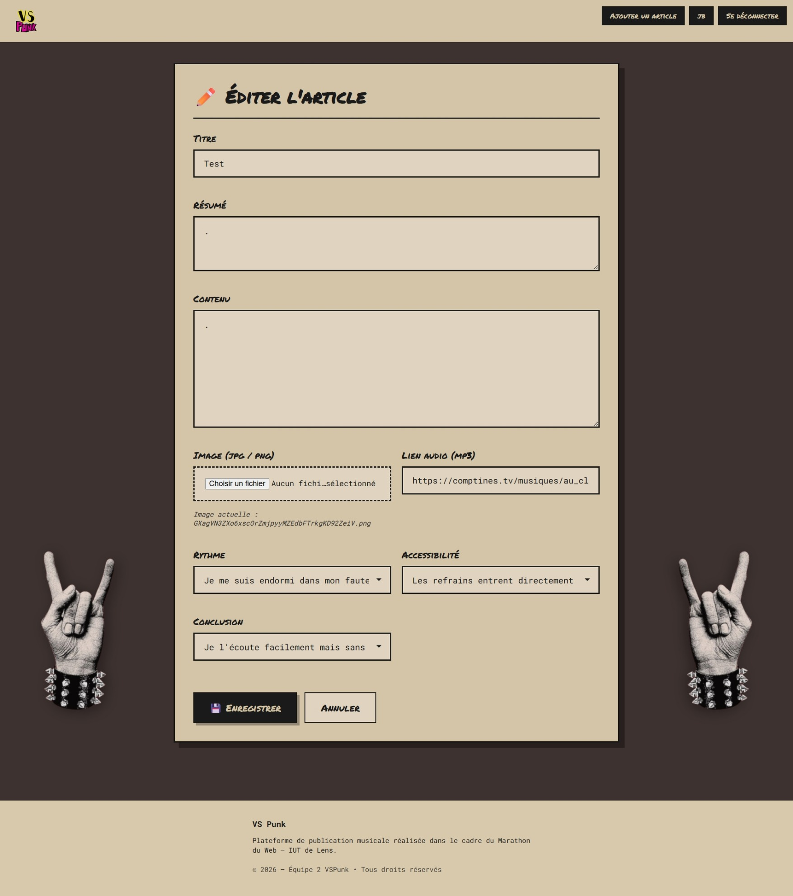

### Inscription utilisateur
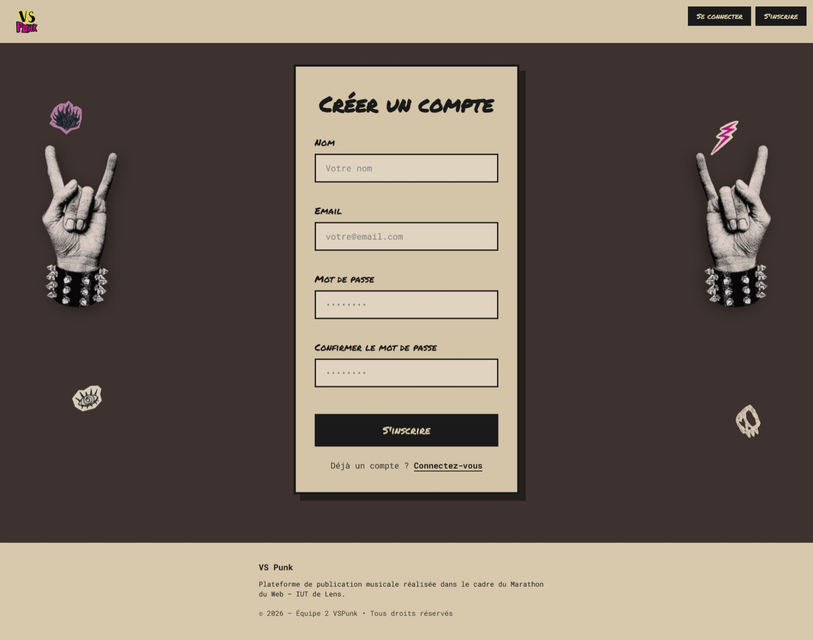

### Connexion utilisateur
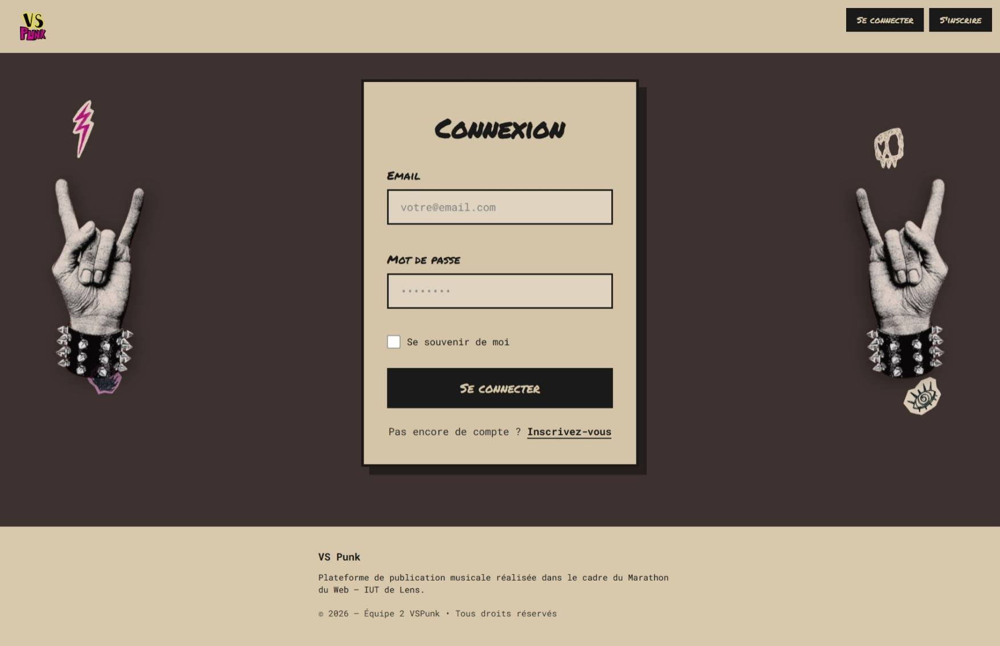

### Profil personnel
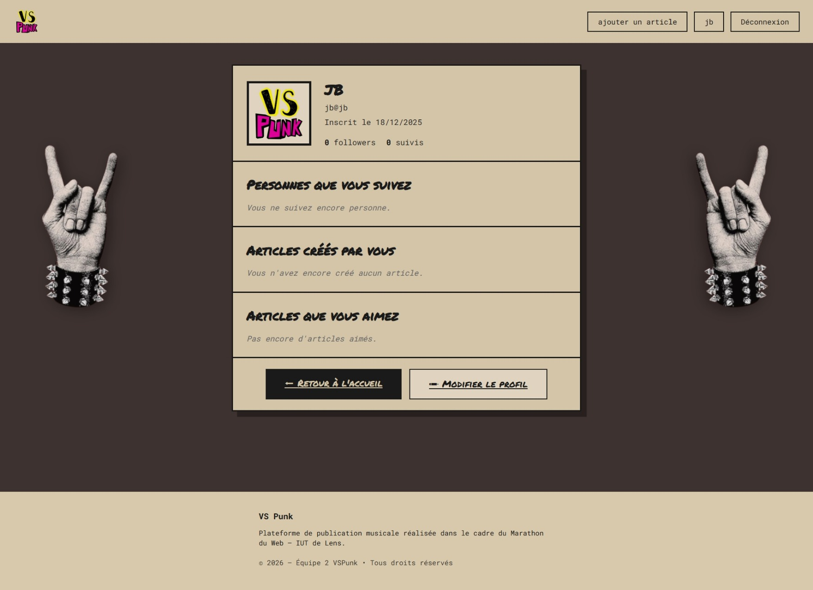

### Modification du profil
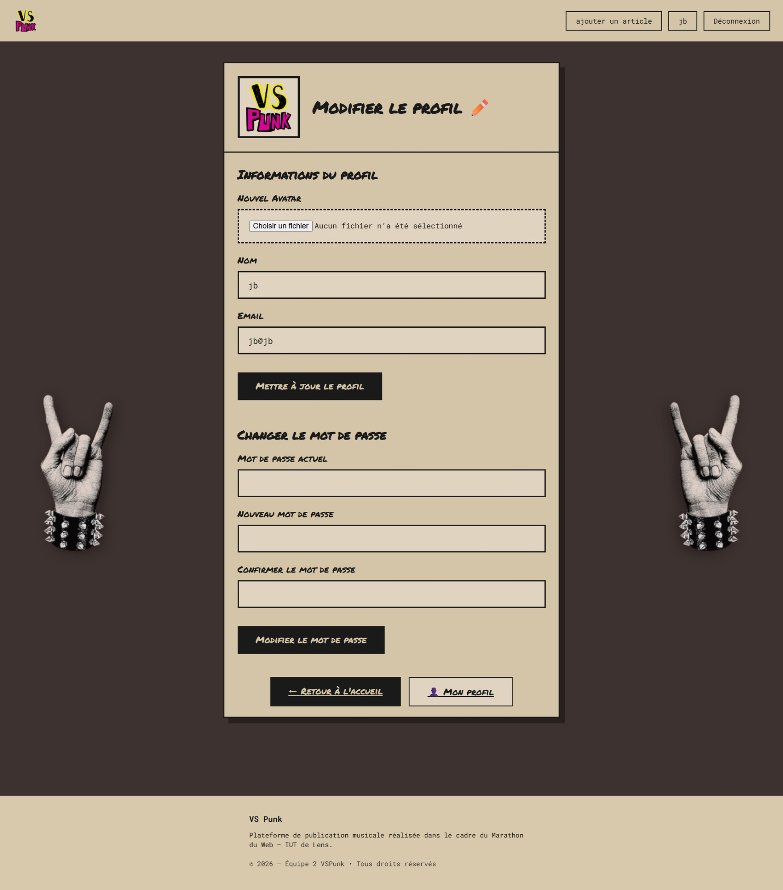

### Page 404
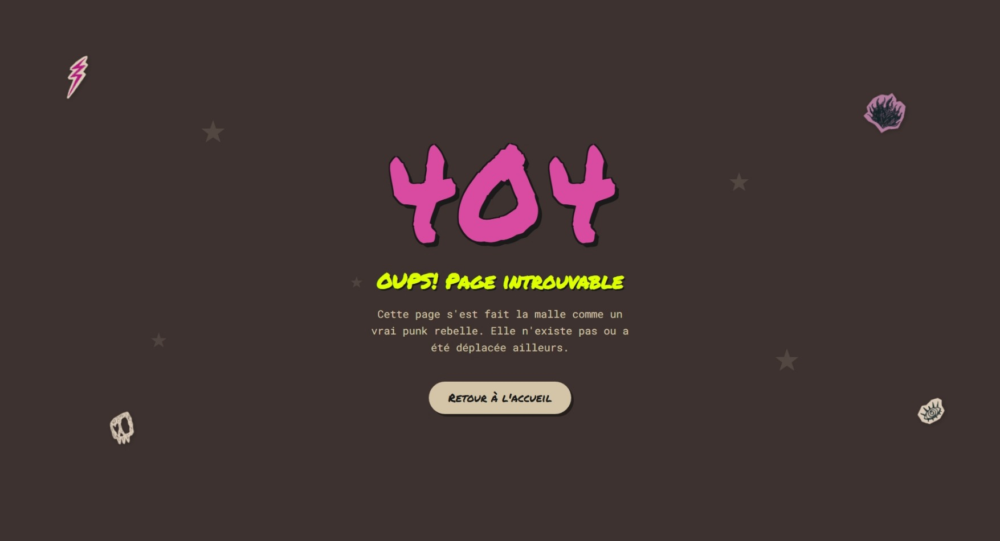
